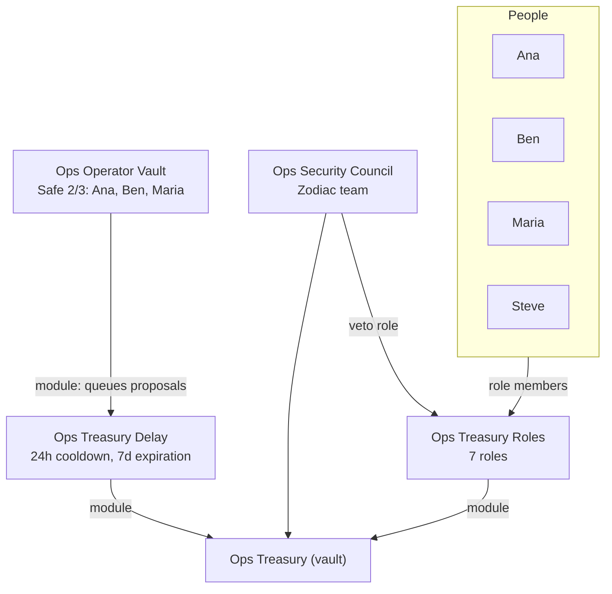

# Ops Treasury Constellation

A small ETH treasury on Ethereum, run by four people: Ana, Ben, Maria and
Steve. Day-to-day work runs through narrow roles with daily budgets. The
Operator Vault queues admin changes through a 24-hour Delay, and the Security
council, run by the Zodiac team, can veto them.

It is built from the [constellation template](https://github.com/gnosisguild/zodiac-constellation-template)
on `@zodiaceco/sdk` 2.4.

## Structure



## Roles

| Role           | Member           | Allows                                                               | Budget                                             |
| -------------- | ---------------- | -------------------------------------------------------------------- | -------------------------------------------------- |
| `payroll`      | Ana              | `WETH.transfer` to Ana, Ben or Maria                                 | 0.0187 WETH (50 USD worth), refilled by the minute |
| `swap`         | Ben              | Wrap and unwrap ETH. CoW orders between WETH, USDC and USDT          | 0.05 WETH, 133 USDC, 133 USDT (per sell token)     |
| `fold_swap`    | Ben              | Wrap ETH. CoW orders that sell WETH for FOLD                         | 0.0187 WETH (50 USD worth)                         |
| `lido_staking` | Maria            | Stake ETH with Lido. Withdrawal requests and claims                  | 0.05 ETH                                           |
| `aave_wsteth`  | Maria            | Wrap and unwrap stETH. Supply wstETH to Aave v3 Core and withdraw it | 0.0401 wstETH (0.05 ETH worth)                     |
| `morpho_usdc`  | Steve            | Deposit USDC into Steakhouse Prime USDC. Withdraw and redeem         | 133 USDC                                           |
| `veto`         | Security council | `setTxNonce` on the Delay                                            | none                                               |

Budgets are set in `constellation/allowances/index.ts`, at prices of
2026-09-29 (ETH/USD 2,675.30, 1.245174 stETH per wstETH). The payroll budget
starts empty and refills by 1/1440 every minute, so it is full after 24 hours.

Zodiac merges roles and budgets into what is deployed, by name. To remove one,
set it to `null` in `constellation/index.ts`.

## Contracts

All on Ethereum mainnet.

| Name in `zodiac.config.ts`     | Address                                      | Notes                                    |
| ------------------------------ | -------------------------------------------- | ---------------------------------------- |
| `weth`                         | `0xC02aaA39b223FE8D0A0e5C4F27eAD9083C756Cc2` |                                          |
| `usdc`                         | `0xA0b86991c6218b36c1d19D4a2e9Eb0cE3606eB48` |                                          |
| `usdt`                         | `0xdAC17F958D2ee523a2206206994597C13D831ec7` |                                          |
| `fold`                         | `0xE172e9B6cfBeeB5593bDcE3f077356FDb33af904` | Interfold (FOLD), 18 decimals            |
| `cowswap.order_signer`         | `0x23dA9AdE38E4477b23770DeD512fD37b12381FAB` | Gnosis Guild CowswapOrderSigner          |
| `cowswap.vault_relayer`        | `0xC92E8bdf79f0507f65a392b0ab4667716BFE0110` | GPv2VaultRelayer                         |
| `lido.steth`                   | `0xae7ab96520DE3A18E5e111B5EaAb095312D7fE84` |                                          |
| `lido.wsteth`                  | `0x7f39C581F595B53c5cb19bD0b3f8dA6c935E2Ca0` |                                          |
| `lido.withdrawal_queue`        | `0x889edC2eDab5f40e902b864aD4d7AdE8E412F9B1` | WithdrawalQueueERC721                    |
| `aave_v3.core_pool`            | `0x87870Bca3F3fD6335C3F4ce8392D69350B4fA4E2` | Aave v3 Ethereum Core market             |
| `morpho.steakhouse_prime_usdc` | `0xbeef088055857739C12CD3765F20b7679Def0f51` | Steakhouse Prime USDC, a Morpho Vault V2 |

## Workflow

```bash
bun install
bun pull          # org users, accounts, contract ABIs (uses ZODIAC_API_KEY from .env)
bun push          # stores the next revision and opens the review page
```

`push` stores a revision only. Nothing is on chain until someone deploys it
from the review page.

## License

LGPL-3.0-only, the same as the template.
